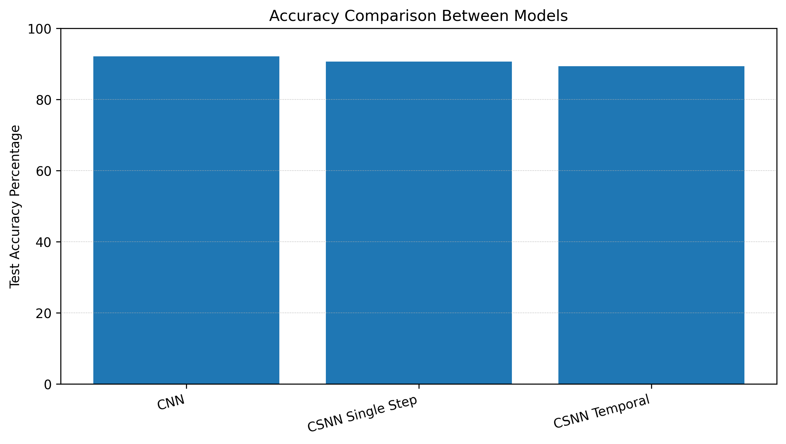
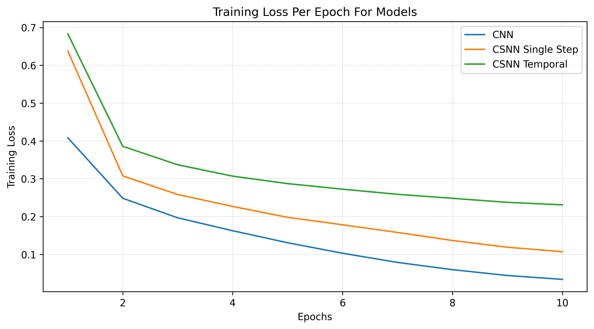

# fashion_mnist_cnn_snn
## About
Supervised image classification project on **Fashion-MNIST**, comparing a
standard convolutional neural network (CNN) baseline against spiking
convolutional neural networks (SNNs) implemented with [snnTorch](https://github.com/jeshraghian/snntorch).

---

## Project Overview

This repository extends my earlier MNIST SNN project to the **Fashion-MNIST**
dataset. The goal is to:

- Build a strong **CNN baseline** for Fashion-MNIST.
- Implement **single-step** and **temporal** spiking CNN models.
- Compare performance, training dynamics, and implementation details between
  standard CNNs and SNNs.

---

## Primary Personal Outcomes

Working through this project, I aim to:

- Continue practice in structuring a PyTorch project with clear separation between
  **models**, **training scripts**, and **result scripts**.
- Understand how to implement and train:
  - A standard CNN classifier for Fashion-MNIST.
  - Spiking CNNs using snnTorch (LIF layers, temporal dynamics).
- Compare **accuracy**, **training stability**, and **inference behavior**
  between CNN and SNN approaches.
- Build a reusable template for future CNN/SNN classification projects.

---

## Repository Structure

```text
FASHION_MNIST_CNN_SNN/
├─ models/
│  ├─ init.py                    # Utility file
│  ├─ cnn_baseline.py            # FashionCNN: standard CNN classifier
│  ├─ csnn_single_step.py        # CSNNSingleStep: single-step spiking CNN
│  └─ csnn_temporal.py           # CSNNTemporal: temporal spiking CNN
│
├─ train_scripts/
│  ├─ init.py                    # Utility file
│  ├─ train_cnn.py               # Train/evaluate CNN baseline
│  ├─ train_csnn_single_step.py  # Train/evaluate single-step SNN
│  └─ train_csnn_temporal.py     # Train/evaluate temporal SNN
│
├─ result_scripts/
│  ├─ init.py                    # Utility file
│  └─ plot_results.py            # Utilities for plotting/analysis of loss and accuracy
│
├─ results/
│  ├─ cnn_loss.json              # Saved per-epoch training loss for CNN
│  ├─ csnn_single_loss.json      # Saved per-epoch training loss for CSNN-Single
│  ├─ csnn_temporal_loss.json    # Saved per-epoch training loss for CSNN-Temporal
│  ├─ test_accuracy_comparison.png    # Overall accuracy comparison bar graph of all models
│  └─ training_loss_comparison.png    # Graph comparing per epoch losses of all models
│
├─ data/                         # Fashion-MNIST will be downloaded here
├─ .venv/                        # Project virtual environment (not committed)
├─ requirements.txt
└─ README.md
```

---

## Models

### CNN Baseline
Standard convolutional neural network for 28×28 grayscale Fashion-MNIST
images.

### CSNN Single Step
Spiking CNN using snnTorch LIF layers. Processes each image in a single time step; behaves like a hybrid CNN/SNN model. Used to compare “one-shot” spiking behavior to the CNN baseline.

### CSNN Temporal
Fully temporal spiking CNN that runs over multiple time steps. Uses spike-encoded inputs (e.g., Poisson rate encoding). Output is decoded over time (e.g., rate-based decoding of class logits).

---

## Environment Setup
A virtual Python environment is reccomended. 
To activate a python environment, paste this command into the terminal in the repo root:
```text
python -m venv .venv
```
---

## Dependencies
Needed dependencies can be installed with the command:
```text
pip install -r requirements.txt
```
---

## Training Scripts
All training scripts are run from the repository root so package imports work properly.
Scripts will download needed dataset (if not previously downloaded), train for the specified amount of epochs and other specified settings, and saves necessary data to results folder.

### Training The CNN:
```text
py -m train_scripts.train_cnn
```

### Training The CSNN Single Step:
```text
py -m train_scripts.train_csnn_single_step
```

### Training The CSNN Temporal:
```text
py -m train_scripts.train_csnn_temporal
```

---

## Running The Experiment

### 1. Set up the environment (optional)
Run the command listed under **Environment Setup** to create a virtual Python environment.

### 2. Install needed dependencies
Install the required packages with the command under **Dependencies**.

### 3. Train The Models
To run the training scripts, paste the listed commands under **Training Scripts** into the repo root. These commands are also located at the top of all training scripts for ease of access when copy-pasting.

### 4. Plot Results
To plot your results after all your models have run, paste the command **py -m result_scripts.plot_results**. The PNGs of the graphs will be sent to the results folder. Note: This will only plot the updated loss graphs, plotting accuracy requires manual input of accuracies to the respective locations in the file.

---

## Testing Results

### Model Accuracy Comparison
| Model        | Epochs | Accuracy % |
|--------------|--------|------------|
| CNN          | 10     | 92.12      |
| CSNN-Single  | 10     | 90.65      |
| CSNN-Temporal| 10     | 89.41      |



### Training Loss Comparison


The standard CNN starts with the lowest training loss and continues to decrease the fastest, indicating that it fits the Fashion-MNIST training data more efficiently than the spiking models. The single-step CSNN tracks in between the CNN and the temporal CSNN, while the temporal CSNN maintains the highest loss throughout training and decreases more slowly. After about the second epoch, all three models show diminishing returns as their loss curves gradually flatten. Together with the accuracy results, this suggests that the temporal CSNN with only 10 timesteps is harder to train effectively, and the combination of noisy Poisson spike encoding and a small number of timesteps likely limits its recognition performance compared to the other models. 

---

## Reproducability

**Python 3.11.6** interpreter was used to create this project.

### Parameters
Below are the parameters I used on the models to generate my results:

| Parameter | Model: CNN  | Model: CSNN-Single | Model: CNN-Temporal |
|-----------|-------------|--------------------|---------------------|
| Batch Size| 128         | 128                | 128                 |           
| Loss Type | CrossEntropy| CrossEntropy       | CrossEntropy        |
| Optimizer | Adam        | Adam               | Adam                |
| Learn Rate| 1e-3        | 1e-3               | 1e-4                |
| Seed      | 0           | 0                  | 0                   |
| Num Steps | N/A         | 1                  | 10                  |

---
## Project Analysis

### Key Findings
The goal of this project was to compare a standard CNN with two spiking CNN variants on the Fashion-MNIST dataset. In my tests, I found: 
- The CNN baseline reached a **92.0%** test accuracy 
- The CSNN single-step reached a **90.6%** test accuracy
- The CSNN temporal at 10 steps reached an **89.4%** test accuracy 

The CNN achieved the best analysis accuracy overall compared to all the other models, but the spiking models still demonstrated that they could be implemented for such a task.

---

### Model Comparison Analysis
The CNN model has the simplest training architecture out of all the models, and performed the most effectively, showing low loss numbers and high identification accuracy at 10 epochs. The single step CSNN model has a relatively simple structure like the CNN, but contains leaky integrate and fire activations. The single step model almost matches the accuracy of the CNN, but is slightly less effective at generalization. The CSNN temporal has the most complex pipeline and architecture, containing a time dimension (num steps) and Poisson encoding. Despite this, the CSNN temporal reports the highest training loss counts and lowest test accuracy, suggesting harder optimizations and a lot of noise during training which directly effects analysis accuracy.

---

### Computational Tradeoffs
Increasing the timestep count on the CSNN temporal results in a massive increase to needed computing power. At 10 timesteps training on CPU, the CSNN temporal took 1.25 hours to complete 10 epochs worth of training. Attempting to increase the amount of timesteps to 50 resulted in an estimated completion time after 14~ hours for 10 epochs. Both the CNN and CSNN single step only needed around 20 minutes to train 10 epochs, with the CNN needing slightly less time. Because of this computation scaling on temporal SNNs, training certain networks with a larger amount of timesteps becomes not viable on certain hardware. On this test, the CSNNs did not overperform the CNN, and increasing the timesteps to 50 might not have resulted in a large enough increase to justify the extra time and computing power.

---

### Experiment Limitations
The networks in this experiment, like my previous one, are quite limited. All networks used a single set of parameters, very limited extra tuning was performed that may have resulted in the optimization and improvement of the models. Other spike encoding schemes may have also resulted in a more optimized CSNN and may have yielded better results. My training hardware for the project is also limited, performing training on the CPU is much slower than using CUDA, which realistically limited how long I could train the CSNN temporal. 

---

### Key Learning Points
- Reinforced knowledge on constructing and training neural networks using PyTorch and SNNTorch
- Improved debugging and problem solving skills such as image shape errors
- Visualized training data and compared them to draw conclusions

---

### Conclusion
In summary, this project demonstrates a complete pipeline for comparing a standard CNN and spiking CNNs on Fashion-MNIST. The CNN achieved the highest test accuracy, while the single-step and temporal SNNs reached slightly lower performance under the same training conditions. The results highlight that, on this dataset and hardware, spiking models trade accuracy and compute cost for more biologically-inspired dynamics rather than raw performance.

---

## License
This project is licensed under the terms of the **MIT License**.  
See the [`LICENSE`](./LICENSE) file for details.
